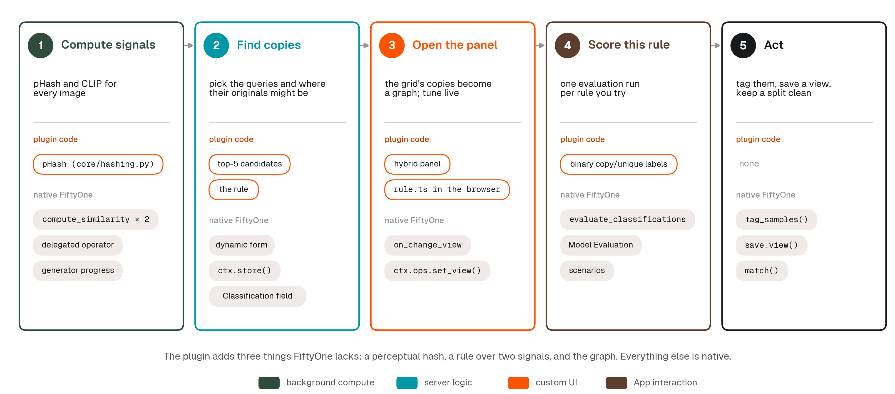
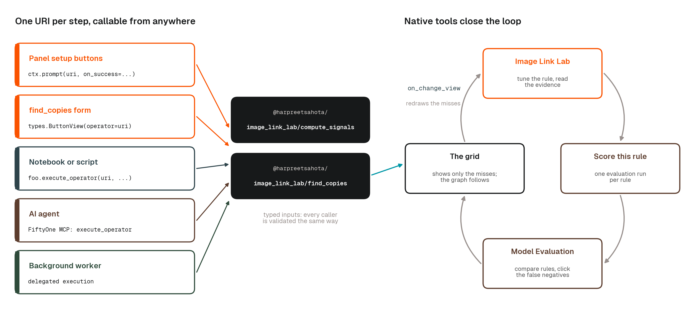
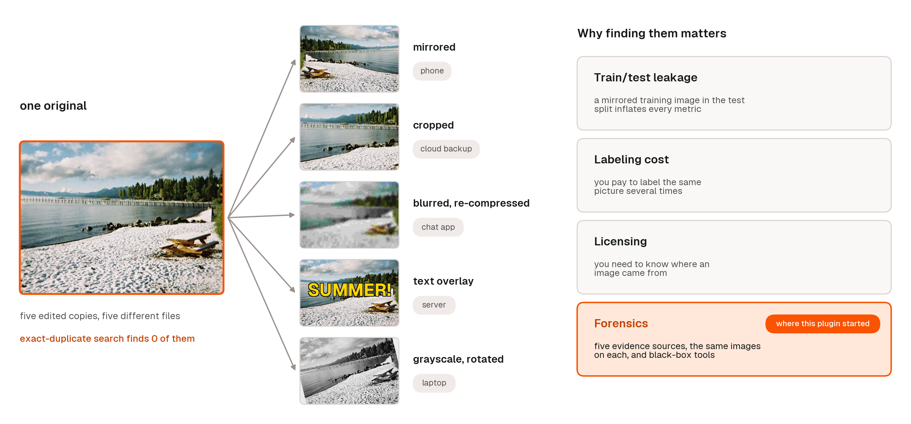
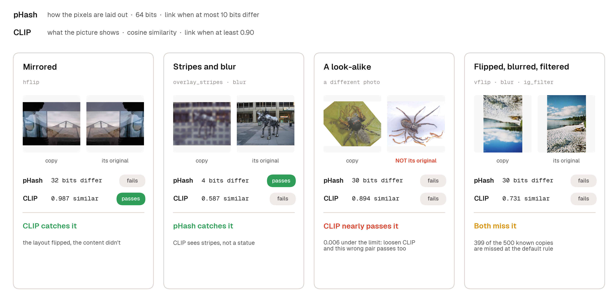
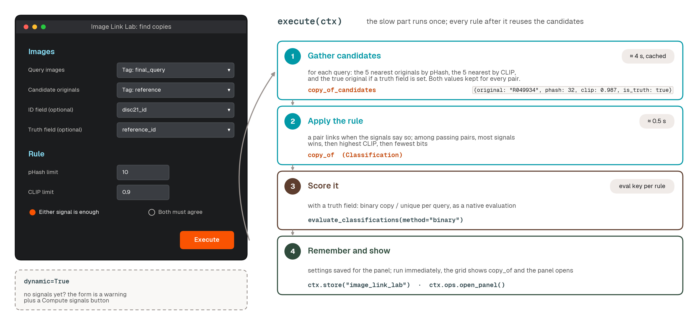
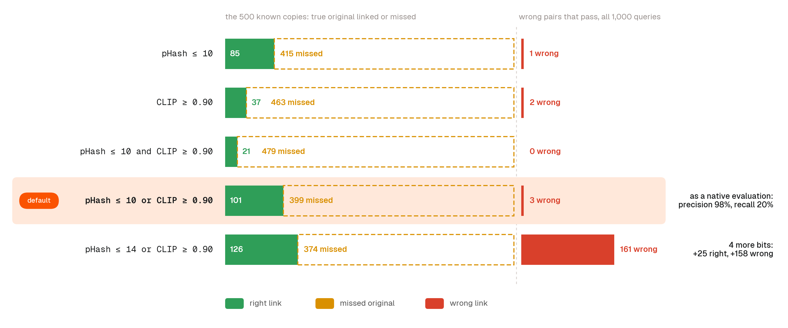
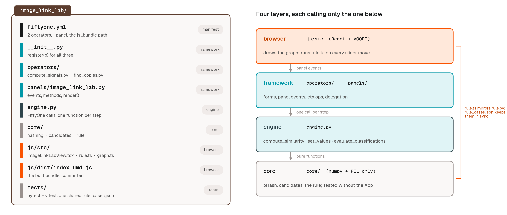
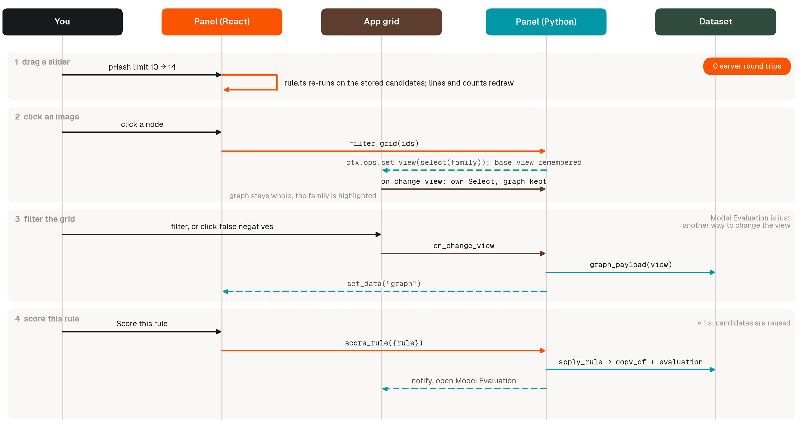

# Image Link Lab

Find edited copies of images, see the links as a graph, and read the evidence behind every one.

Two signals do the finding: **pHash** (how the pixels are laid out) and **CLIP** (what the picture shows). A rule you control combines them. The **Image Link Lab** panel draws the copies in your grid as nodes and the links as lines, updates as you move the sliders, and tells you in one sentence why each link is there. If you know the true originals, it scores the rule with FiftyOne's native evaluation so you can compare rules in Model Evaluation.

Built from standard FiftyOne parts: two operators, one hybrid panel, native similarity indexes, native evaluation runs. The plugin adds only what FiftyOne lacks: a perceptual hash, a rule over two signals, and the graph.

<picture>
  <source media="(prefers-color-scheme: dark)" srcset="assets/dark/ll_03_workflow.png">
  
</picture>

---

## Install

```bash
fiftyone plugins download https://github.com/harpreetsahota204/image_link_lab
fiftyone plugins requirements @harpreetsahota/image_link_lab --install
```

For development, clone the repo and symlink it into your plugins directory instead:

```bash
git clone https://github.com/harpreetsahota204/image_link_lab.git
ln -s "$(pwd)/image_link_lab" "$(python -c 'import fiftyone as fo; print(fo.config.plugins_dir)')/@harpreetsahota/image_link_lab"
pip install -r image_link_lab/requirements.txt
```

Requires `fiftyone>=1.22.1`. CLIP runs on CPU but is much faster on a GPU. The JS bundle (`js/dist/index.umd.js`) is committed, so no build step is needed; to rebuild after editing `js/src`, run `cd js && yarn install && yarn build`.

## Quick start (App)

1. Open a dataset and add the **Image Link Lab** panel (the `+` next to Samples, under Custom).
2. Click **Compute signals**, keep both boxes ticked, execute. Runs in the background; a minute per 10,000 images for pHash plus CLIP time.
3. Click **Find copies**. Pick the query images (the ones to explain), where their originals might be, optionally an ID field and a truth field, and execute.
4. The graph appears. Move the sliders. Click a line for the evidence; click an image to see its family in the grid.
5. Click **Score this rule** to record an evaluation and open Model Evaluation.

## Quick start (SDK)

Everything the App does is an operator, so a notebook, a script or an agent can run it.

<picture>
  <source media="(prefers-color-scheme: dark)" srcset="assets/dark/ll_09_composable.png">
  
</picture>

```python
import fiftyone as fo
import fiftyone.operators as foo

dataset = fo.load_dataset("disc21_link_lab")

# Step 1: signals (delegate=False runs it in this process)
foo.execute_operator(
    "@harpreetsahota/image_link_lab/compute_signals",
    {"dataset": dataset, "params": {"phash": True, "clip": True, "delegate": False}},
)

# Step 2: copies, with a rule, scored against a truth field
result = foo.execute_operator(
    "@harpreetsahota/image_link_lab/find_copies",
    {
        "dataset": dataset,
        "params": {
            "queries": "tag:final_query",      # or "view", "dataset", "tag:<tag>"
            "originals": "tag:reference",
            "id_field": "disc21_id",           # optional
            "truth_field": "reference_id",     # optional; turns on scoring
            "phash_max": 10,
            "clip_min": 0.90,
            "combine": "any",                  # "any" or "all"
            "delegate": False,
        },
    },
)
print(result.result)
# {'queries': 1000, 'linked': 104, 'right': 101, 'wrong': 3, 'missed': 399,
#  'precision': 0.9806, 'recall': 0.202, 'eval_key': 'copies_phash10_or_clip90', ...}

# The results are ordinary FiftyOne fields and runs
copies = dataset.match(fo.ViewField("copy_of.label") != "none")
dataset.load_evaluation_results("copies_phash10_or_clip90").print_report()
```

Run `find_copies` again with a different rule and the candidates are reused, so it takes about a second and adds another evaluation run to compare.

---

## User guide

### 1. The problem

Image collections are full of edited copies of the same picture: cropped, mirrored, recolored, blurred, re-compressed, covered in text or emoji. Finding which image is a copy of which matters in more places than it seems:

- **Train/test leakage.** A mirrored copy of a training image in your test set inflates your metrics.
- **Labeling cost.** You pay to label the same picture several times.
- **Licensing and attribution.** You need to know where an image came from.
- **Moderation and forensics.** A known-bad image comes back with a filter on it, or turns up on a second device.

<picture>
  <source media="(prefers-color-scheme: dark)" srcset="assets/dark/ll_01_problem.png">
  
</picture>

FiftyOne already finds byte-identical files (`compute_exact_duplicates`) and near-duplicates by a single embedding (`compute_near_duplicates`, the Similarity Search panel). What it doesn't do is combine two different kinds of similarity with a rule you control, and show you which image is linked to which and why. That gap is what this plugin fills.

### 2. The idea: pixels versus meaning

A **perceptual hash** (pHash) summarizes how an image's pixels are laid out in 64 bits. Two images whose hashes differ in few bits look the same at a glance. It is fast, needs no model, and is unbothered by recompression or a small blur. It is defeated by anything that moves pixels around: a mirror, a rotation, a big crop.

A **CLIP embedding** summarizes what the picture shows. Two images with a high cosine similarity are about the same thing. It survives mirrors and crops. It is fooled by look-alikes: two different photos of the same kind of scene can score higher than a heavily blurred copy of the same photo.

Each signal has a blind spot the other doesn't. The plugin computes both for every image and lets you say how they combine:

- **Either signal is enough** (`any`): link the pair if pHash *or* CLIP passes. More links, more wrong ones.
- **Both must agree** (`all`): link only if both pass. Fewer links, almost all right.

Each signal has a limit you set: the most bits pHash may differ by, and the least similarity CLIP must reach. Moving a limit is the whole game, and the graph shows you the consequences as you move it.

<picture>
  <source media="(prefers-color-scheme: dark)" srcset="assets/dark/ll_02_signals.png">
  
</picture>

### 3. Step 1: Compute signals

What it writes:

| Where | What |
|---|---|
| `phash` field | the 64-bit pHash of each image, as hex |
| brain key `phash` | the hash bits as a native similarity index, so the App's sort-by-similarity works on pHash too |
| brain key `clip` | a native CLIP similarity index (`clip-vit-base32-torch` from the zoo) |

It runs delegated by default, so launch an orchestrator (`fiftyone delegated launch`) or choose "Execute now" in the form. Already-computed signals are left alone unless you tick them.

### 4. Step 2: Find copies

The form has two sections.

**Images.** *Query images* are the ones you want explained: each will be linked to at most one original. *Candidate originals* is where to look. Both can be the current view, the whole dataset, or a tag. They can overlap; an image is never linked to itself.

*ID field* (optional) is what to call each image. If your dataset identifies images by something other than the sample ID, pick that field, and links and labels will use it.

*Truth field* (optional) holds, for each query, the ID of its known original. Set it and you get scoring: right/wrong/missed colors in the graph, counts, and a native evaluation. Leave it empty and the plugin works unsupervised: links are drawn, nothing is judged.

**Rule.** The starting pHash limit, CLIP limit, and either/both. You will change these in the panel; this is just where the first result comes from.

What it does:

1. **Gathers candidates.** For each query, the 5 nearest originals by pHash and the 5 nearest by CLIP, plus the true original if a truth field is set and it wasn't already among them. For every candidate it stores both signals' values. This is the slow step (about 4 s for 1,000 queries against 5,000 originals) and it is reused by every later run, which is why re-scoring takes a second.
2. **Applies the rule** and writes `copy_of`: a `Classification` per query whose label is the linked original's ID, or `none`. When several candidates pass, the one passing the most signals wins, then the highest CLIP similarity, then the fewest differing bits.
3. **Scores**, if a truth field is set. See section 7.

<picture>
  <source media="(prefers-color-scheme: dark)" srcset="assets/dark/ll_06_find_copies.png">
  
</picture>

### 5. Reading the graph

The panel follows the grid: whatever queries are in the current view (up to 40 at a time) are drawn. Filter the grid, and the graph redraws.

- **Nodes are images.** Copies have a grey border; originals have an orange border and, when more than one copy points at them, a badge with the count.
- **Lines are candidate pairs the rule has something to say about.** Green: a right link (the rule linked a copy to its true original). Red: a wrong link (linked, but not the true original). Dashed amber: a missed original (the true original, not linked). Pairs that neither pass nor matter are hidden by default; they are the faint dotted *candidates*.
- **The chips above the graph are the legend, the counts and a filter in one.** Each chip shows its line style and how many pairs of that kind are on screen. Click a chip to show only that kind of line (click **wrong** and the graph becomes just the red links, laid out as their own families); click it again to go back; shift-click to add or remove a kind, for example to switch the faint candidates on.
- **Thick lines pass both signals; thin lines pass one.** A thick green line is "two independent reasons." A thin red one is "one weak reason."
- **Families.** Images joined by lines are laid out as a star: originals in the middle, copies around them. A loose rule joins families through wrong links; you will see red lines bridging two stars.
- **No links.** Queries with nothing to draw sit in a strip at the bottom. For a distractor with no original, that is the correct outcome.

**Moving around.** Scroll to pan, ⌘/Ctrl + scroll (or pinch) to zoom, drag to move, and use the +, − and Fit buttons in the corner. The graph refits itself when a different set of copies comes into view.

**Clicking an image filters the grid** to that image and everything it has a line to: an original and all its copies, or a copy and the originals it was linked to or should have been. The originals are shown even when your current view doesn't contain them (the usual case: you're looking at the copies). The graph stays whole, with the family highlighted and the rest dimmed, and a chip in the toolbar shows how many images the grid is showing. Click the same image again, click the background, press Esc, or use the chip's × to clear it, and the grid goes back to exactly the view you had before. Double-click an image to open it in the sample modal.

Without a truth field, every link is drawn green and nothing is dashed. The colors mean "linked," not "right."

### 6. Tuning the rule

The three preset buttons switch signals on and off: **pHash only**, **CLIP only**, **Both**. The sliders set the limits. The rule is applied in the browser to the stored candidate values, so the lines and counts update as you drag, with no server round-trip.

What to expect on the demo dataset (DISC21: 1,000 edited queries, 5,000 originals, 500 queries with a known original):

| Rule | Right | Wrong | Missed |
|---|---|---|---|
| pHash ≤ 10 | 85 | 1 | 415 |
| CLIP ≥ 0.90 | 37 | 2 | 463 |
| pHash ≤ 10 or CLIP ≥ 0.90 | 101 | 3 | 399 |
| pHash ≤ 10 and CLIP ≥ 0.90 | 21 | 0 | 479 |
| pHash ≤ 14 or CLIP ≥ 0.90 | 126 | 161 | 374 |

Read the last two rows together: tightening to "both must agree" removes every wrong link and most right ones; loosening pHash by 4 bits adds 25 right links and 158 wrong ones (precision drops from 98% to 66%). There is no setting that gets everything, and the point of the panel is to see where the trade-off sits for your data, not to hide it behind one number.

The DISC21 edits are deliberately brutal (heavy crops, overlays, blends), so recall is low across the board. On a collection of ordinary re-uploads, pHash alone will catch most copies.

<picture>
  <source media="(prefers-color-scheme: dark)" srcset="assets/dark/ll_10_tradeoff.png">
  
</picture>

### 7. The evidence pane

Click a line. A pane slides in over the right of the graph with the copy and the original side by side, then one row per signal:

```
pHash   pixels    30 bits differ    limit ≤ 10    fails
CLIP    meaning   0.731 similar     limit ≥ 0.90  fails
```

and a verdict in a sentence: *Not linked: pHash and CLIP are outside the limit. This is the true original, so the rule missed it.* Every statement can be checked against the numbers above it; there is no model deciding behind the scenes.

**Show pair in grid** filters the grid to just these two images (clear it like any other click filter). **Open copy** opens the query in the modal. Close the pane with ✕, Esc, or a click on the background. The **?** next to the chips lists every interaction, including line thickness (thick passes both signals, thin passes one).

### 8. Scoring, and what "evaluation" means here

With a truth field set, the chips count the pairs on screen: **right**, **wrong**, **missed**, and the unlinked **candidates**. These are per pair (one copy can contribute several) and only for the copies currently drawn. **Score this rule** runs the rule over every query (not just the 40 on screen), writes `copy_of`, and records a native FiftyOne evaluation named after the rule, for example `copies_phash10_or_clip90`. It then opens Model Evaluation.

The evaluation is **binary, per query**:

- Ground truth is `copy` if the query has a known original, `unique` if it doesn't (a distractor).
- Prediction is `copy` if the rule linked the query to its true original, `unique` otherwise. For a distractor, any link at all counts as `copy`.

From those two labels FiftyOne computes the usual numbers:

- **Precision**: of the queries the rule called copies, what fraction were really copies linked to the right original. High precision means few false alarms.
- **Recall**: of the queries that really are copies, what fraction the rule found. High recall means few misses.
- **F1**: the balance of the two.

The table in section 6 is these numbers in disguise: right / (right + wrong on distractors) is precision; right / 500 is recall.

One definition to keep in mind: **a copy linked to the wrong original counts as a miss, not a false positive.** The evaluation asks "did we find the true original?" and the answer is no. The panel's **wrong** count is where those links show up, so read the two together.

In Model Evaluation you can:

- Compare two rules side by side (score each, then use the compare view).
- Click **false negatives** to filter the grid to the misses. The panel's graph follows and redraws those queries with their dashed lines, so you can click each one and see which signal fell short and by how much.
- Slice by any field with **scenarios**. On DISC21, slicing by `transform_names` shows which edit types each signal survives.

Without a truth field there is no evaluation. **Apply this rule** still writes `copy_of` and tells you how many queries got linked.

### 9. Acting on the results

`copy_of` is an ordinary label field, so everything else in FiftyOne works on it.

```python
from fiftyone import ViewField as F

copies = dataset.match(F("copy_of.label") != "none")
copies.tag_samples("copy")
dataset.save_view("copies", copies)

# Keep a test split clean
clean_test = dataset.match_tags("test").match(F("copy_of.label") == "none")

# Everything linked to one original
dataset.match(F("copy_of.label") == "R003513")

# The pairs' evidence, for a report
dataset.match(F("copy_of.label") != "none").values(["copy_of.label", "copy_of.phash", "copy_of.clip"])
```

### 10. Using your own dataset

Any image dataset works. You need:

- **Images.** That is all, for the unsupervised case: compute signals on the dataset, run find copies with queries = originals = whole dataset, and the graph shows the families the rule finds.
- **An ID field**, if your images are identified by something other than the sample ID (a filename stem, a hash, a case number).
- **A truth field**, if you want scoring: on each query, the ID of its known original. Leave it empty on data where you don't know.

Typical setups:

| Situation | Queries | Originals | Truth |
|---|---|---|---|
| Dedup a collection | whole dataset | whole dataset | none |
| Check a test split for leakage | tag `test` | tag `train` | none |
| Match seized images against a known-bad list | the seized images | the known-bad list | none, or a case label |
| Benchmark a rule | the edited images | the originals | the original's ID |

Large pools: candidates are gathered with dense distance matrices, which is fine into the tens of thousands of originals. Beyond that, narrow the originals to a tag or a view.

### 11. What gets written, and how to undo it

| Name | Kind | Written by |
|---|---|---|
| `phash` | sample field | compute signals |
| `phash`, `clip` | brain keys | compute signals |
| `copy_of_candidates` | sample field (list of dicts) | find copies |
| `copy_of` | `Classification` field | find copies, Score this rule |
| `copy_of_gt`, `copy_of_pred` | `Classification` fields (binary labels) | find copies with a truth field |
| `copies_*` | evaluation keys | find copies with a truth field, Score this rule |

The output field name is a setting; `copy_of` is the default. To remove everything:

```python
for f in ("phash", "copy_of_candidates", "copy_of", "copy_of_gt", "copy_of_pred"):
    if dataset.has_sample_field(f):
        dataset.delete_sample_field(f)
for k in ("phash", "clip"):
    if k in dataset.list_brain_runs():
        dataset.delete_brain_run(k)
for k in dataset.list_evaluations():
    if k.startswith("copies_"):
        dataset.delete_evaluation(k)
```

After find copies the grid shows only `copy_of` among the label fields; tick the others in the sidebar if you want them.

### 12. Questions that come up

**"No copies in the current grid view."** The graph draws the queries in the current view. Clear your filters, or filter to the query images (the tag you chose in Find copies).

**The graph shows "40 of 1000."** It draws up to 40 queries at a time to stay readable. Filter the grid to the ones you care about: a tag, an edit type, the false negatives from Model Evaluation.

**I changed the images or the fields.** Find copies notices and re-gathers candidates. To force it, tick *Re-gather candidates*.

**CLIP is slow.** It is the only model in the pipeline, and it runs once. On CPU, budget about a second per image; on a GPU, a few minutes for several thousand.

**Can I use a different embedding?** Not from the form; the plugin is deliberately opinionated: one signal for pixels, one for meaning. To swap models, change `CLIP_MODEL` in `constants.py` to any zoo model that produces embeddings.

**Can an agent run it?** Yes. Both operators have typed inputs and are visible through the FiftyOne MCP server (`list_operators`, `get_operator_schema`, `execute_operator`), so an agent can compute signals, try a rule, and read back precision and recall.

---

## How it's built

```
operators/compute_signals.py   step 1: pHash field + two native similarity indexes
operators/find_copies.py       step 2: candidates, rule, copy_of, native binary evaluation
panels/image_link_lab.py       loads the graph for the current view; actions (select, open, score)
engine.py                      FiftyOne glue shared by the operators and the panel
core/                          pure Python: hashing, candidate gathering, the rule (pytest)
js/src/                        the panel UI in React + VOODO: rule.ts mirrors core/rule.py,
                               graph.ts builds families, layout.ts packs the stars, Graph.tsx draws them
```

<picture>
  <source media="(prefers-color-scheme: dark)" srcset="assets/dark/ll_04_anatomy.png">
  
</picture>

The rule exists twice on purpose: in Python for the operators and in TypeScript so the sliders can run it in the browser. `tests/fixtures/rule_cases.json` is shared by both test suites, so they can't drift.

<picture>
  <source media="(prefers-color-scheme: dark)" srcset="assets/dark/ll_08_interactions.png">
  
</picture>

Everything else is native FiftyOne: CLIP comes from `compute_similarity`, the pHash bits are registered as a second similarity index, results are plain `Classification` fields, scoring is `evaluate_classifications`, and rule history lives in evaluation runs. The panel talks to the App through `ctx.ops` (select samples, set the view, open a sample, open Model Evaluation) and opens the operator forms with `ctx.prompt`.

```bash
# Tests
PYTEST_DISABLE_PLUGIN_AUTOLOAD=1 python -m pytest tests -q
cd js && yarn typecheck && yarn test
```

## License

Apache 2.0
